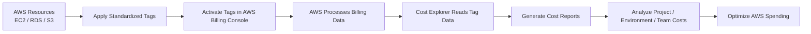

# POC – AWS Cost Allocation Tags Implementation

---

| Author      | Created On | Version | Last Updated By | Last Edited On | L0 Reviewer | L1 Reviewer     | L2 Reviewer     |
| ----------- | ---------- | ------- | --------------- | -------------- | ----------- | --------------- | --------------- |
| Saransh Rai | 2026-03-07 | 1.0     | Saransh Rai     | 2026-03-07     | Anuj Jain   | Prashant Sharma | Piyush Upadhyay |

---

# Table of Contents

1. [Introduction](#1-introduction)
2. [What are AWS Cost Allocation Tags?](#2-what-are-aws-cost-allocation-tags)
3. [Benefits of AWS Cost Allocation Tags](#3-benefits-of-aws-cost-allocation-tags)
4. [Prerequisites & Workflow](#4-prerequisites--workflow)
5. [Tagging Strategy](#5-tagging-strategy)
   * &nbsp;&nbsp;&nbsp;&nbsp; [5.1 Tags Used in this POC](#-51-tags-used-in-this-poc)
   * &nbsp;&nbsp;&nbsp;&nbsp; [5.2 AWS Cost Allocation Tags Workflow](#-52-aws-cost-allocation-tags-workflow)
   * &nbsp;&nbsp;&nbsp;&nbsp; [5.3 Workflow Explanation](#-53-workflow-explanation)
6. [Resource Tagging Implementation](#6-resource-tagging-implementation)
   * &nbsp;&nbsp;&nbsp;&nbsp; [6.1 EC2 Instance Tags](#-61-ec2-instance-tags)
   * &nbsp;&nbsp;&nbsp;&nbsp; [6.2 RDS Database Tags](#-62-rds-database-tags)
   * &nbsp;&nbsp;&nbsp;&nbsp; [6.3 S3 Bucket Tags](#-63-s3-bucket-tags)
7. [Cost Allocation Tag Activation](#7-cost-allocation-tag-activation)
   * &nbsp;&nbsp;&nbsp;&nbsp; [7.1 Steps Performed](#-71-steps-performed)
   * &nbsp;&nbsp;&nbsp;&nbsp; [7.2 Activated Tags](#-72-activated-tags)
8. [Cost Analysis Using Cost Explorer](#8-cost-analysis-using-cost-explorer)
   * &nbsp;&nbsp;&nbsp;&nbsp; [8.1 Steps Performed](#-81-steps-performed)
   * &nbsp;&nbsp;&nbsp;&nbsp; [8.2 Report Configuration](#-82-report-configuration)
9. [Cost Report Export](#9-cost-report-export)
   * &nbsp;&nbsp;&nbsp;&nbsp; [9.1 Steps Performed](#-91-steps-performed)
   * &nbsp;&nbsp;&nbsp;&nbsp; [9.2 Exported Report Includes](#-92-exported-report-includes)
10. [Advantages & Disadvantages](#10-advantages--disadvantages)
11. [Best Practices](#11-best-practices)
12. [Troubleshooting](#12-troubleshooting)
13. [Conclusion](#13-conclusion)
14. [Contact Information](#14-contact-information)
15. [References](#15-references)

---

# 1. Introduction

AWS Cost Allocation Tags are metadata labels (key-value pairs) applied to AWS resources to track and categorize cloud spending. When activated in the Billing Console, they appear in Cost Explorer and cost reports, enabling granular visibility into where money is being spent across teams, projects, and environments.

---

# 2. What are AWS Cost Allocation Tags?

AWS Cost Allocation Tags are key-value pairs attached to AWS resources.

Example:

| Tag Key     | Tag Value   |
| ----------- | ----------- |
| Environment | Production  |
| Project     | EmployeeAPI |
| Owner       | DevOpsTeam  |
| CostCenter  | Engineering |

These tags help:

* Organize AWS resources logically
* Categorize cloud spending
* Track project-level expenses
* Improve billing transparency
* Generate cost reports based on tags

AWS supports two types of tags:

| Tag Type           | Description                           |
| ------------------ | ------------------------------------- |
| AWS-Generated Tags | Automatically created by AWS services |
| User-Defined Tags  | Custom tags created by users          |

---

# 3. Benefits of AWS Cost Allocation Tags

| Benefit           | Description                               |
| ----------------- | ----------------------------------------- |
| Cost Visibility   | Helps identify where money is being spent |
| Budget Tracking   | Enables project-wise budget management    |
| Cost Optimization | Identifies unnecessary resources          |
| Governance        | Improves cloud resource organization      |
| Reporting         | Generates department-wise cost reports    |
| Automation        | Enables automated policy management       |

---

# 4. Prerequisites & Workflow

The following prerequisites were required before implementing AWS Cost Allocation Tags.

| Prerequisite                     | Justification                                                |
| -------------------------------- | ------------------------------------------------------------ |
| AWS Account                      | Required to access AWS resources and Billing Console         |
| IAM Permissions                  | Needed to create tags and access billing information         |
| AWS Billing Access Enabled       | Required to activate Cost Allocation Tags                    |
| Existing AWS Resources           | Resources such as EC2, RDS, or S3 are needed for tagging     |
| Standardized Tagging Strategy    | Ensures consistent cost tracking and reporting               |
| Cost Explorer Enabled            | Required for analyzing tagged resource costs                 |
| Basic Understanding of AWS Tags  | Helps in implementing proper tagging structure               |

Click to Expand AWS Cost Allocation Workflow Screenshot

# 5. Tagging Strategy

A standardized tagging strategy was implemented for AWS resources.

##      5.1 Tags Used in this POC

| Tag Key     | Value    |
| ----------- | -------- |
| Project     | DemoApp  |
| Owner       | Saransh  |
| Environment | Dev      |
| CostCenter  | Learning |

This tagging structure helps AWS group cloud costs based on projects and ownership.

##      5.2 AWS Cost Allocation Tags Workflow

##      5.3 Workflow Explanation

The workflow begins by applying standardized tags to AWS resources such as EC2, RDS, and S3. After tagging, the required Cost Allocation Tags are activated in the AWS Billing Console. AWS then processes billing data using these tags, which becomes available in AWS Cost Explorer. Finally, tagged cost reports are generated to analyze project-wise, environment-wise, and team-wise cloud spending for cost optimization and governance.

---

# 6. Resource Tagging Implementation

##      6.1 EC2 Instance Tags

The EC2 instance was tagged using the defined tagging strategy.

### Example Tags Applied

| Key         | Value    |
| ----------- | -------- |
| Project     | DemoApp  |
| Owner       | Saransh  |
| Environment | Dev      |
| CostCenter  | Learning |

Click to Expand EC2 Tags Screenshot

Click to Expand EC2 Tags Screenshot

---

##      6.2 RDS Database Tags

The RDS database was also tagged using the same tagging structure.

### Example Tags Applied

| Key         | Value    |
| ----------- | -------- |
| Project     | DemoApp  |
| Owner       | Saransh  |
| Environment | Dev      |
| CostCenter  | Learning |

Click to Expand RDS Tags Screenshot

---

##      6.3 S3 Bucket Tags

Tags were added to the S3 bucket to track storage-related costs.

### Example Tags Applied

| Key         | Value    |
| ----------- | -------- |
| Project     | DemoApp  |
| Owner       | Saransh  |
| Environment | Prod     |
| CostCenter  | Learning |

Click to Expand S3 Bucket Tags Screenshot

---

# 7. Cost Allocation Tag Activation

After applying tags to AWS resources, the tags were activated in AWS Billing and Cost Management.

## &nbsp;&nbsp;&nbsp;&nbsp; 7.1 Steps Performed

1. Navigate to AWS Billing and Cost Management
2. Open Cost Allocation Tags
3. Search for required tag keys
4. Activate the required tags

## &nbsp;&nbsp;&nbsp;&nbsp; 7.2 Activated Tags

* Project
* Owner
* Name
* Environment

Once activated, AWS starts processing billing data using these tags.

Click to Expand Cost Allocation Activation Screenshot

---

# 8. Cost Analysis Using Cost Explorer

AWS Cost Explorer was used to analyze cloud spending based on resource tags.

## &nbsp;&nbsp;&nbsp;&nbsp; 8.1 Steps Performed

1. Open AWS Billing and Cost Management
2. Navigate to Cost Explorer
3. Create a Cost Report
4. Group costs using tags

## &nbsp;&nbsp;&nbsp;&nbsp; 8.2 Report Configuration

| Parameter   | Value          |
| ----------- | -------------- |
| Time Range  | Last 7 Days    |
| Granularity | Daily          |
| Metric      | Unblended Cost |
| Group By    | Tag            |
| Tag Key     | Project        |

This configuration groups AWS spending based on the Project tag.

Click to Expand Cost Explorer Screenshot

---

# 9. Cost Report Export

AWS Cost Explorer allows exporting billing reports for analysis and auditing.

## &nbsp;&nbsp;&nbsp;&nbsp; 9.1 Steps Performed

1. Open AWS Cost Explorer
2. Click Download CSV
3. Export the billing report

## &nbsp;&nbsp;&nbsp;&nbsp; 9.2 Exported Report Includes

| Date | Project | Service | Cost |

Click to Expand Cost Report Screenshot

---

# 10. Advantages & Disadvantages

| Advantages               | Disadvantages                           |
| ------------------------ | --------------------------------------- |
| Granular cost visibility | Requires strict governance & discipline |
| Faster cost analysis     | Incorrect tagging leads to bad data     |
| Improved forecasting     | Initial setup effort is high            |
| Team accountability      | Manual tagging can be error-prone       |
| FinOps enablement        | Delay in billing data updates (~24h)    |
| Multi-account support    | Needs continuous monitoring & audits    |

---

# 11. Best Practices

| Best Practice         | Description                                |
| --------------------- | ------------------------------------------ |
| Use Standard Naming   | Maintain consistent tag naming conventions |
| Apply Mandatory Tags  | Ensure all resources have required tags    |
| Automate Tagging      | Use automation policies where possible     |
| Review Tags Regularly | Remove outdated or unused tags             |
| Use AWS Organizations | Enforce tagging policies across accounts   |
| Monitor Cost Reports  | Continuously review billing reports        |

---

# 12. Troubleshooting

| Issue                             | Possible Cause       | Solution                             |
| --------------------------------- | -------------------- | ------------------------------------ |
| Tags Not Visible in Cost Explorer | Tags not activated   | Activate tags in Billing Console     |
| Incorrect Cost Grouping           | Wrong tag values     | Verify tagging consistency           |
| Missing Billing Data              | AWS processing delay | Wait 24 hours for billing refresh    |
| Resources Untagged                | Manual oversight     | Implement automated tagging policies |

---

# 13. Conclusion

This POC demonstrates how AWS Cost Allocation Tags help improve cloud cost visibility, tracking, and governance. By applying standardized tags and enabling them in AWS Billing, organizations can analyze spending more effectively, improve budgeting, increase accountability, and optimize overall AWS costs.

---

# 14. Contact Information

| Name        | Contact Type | Details                                                                         |
| ----------- |------------  | ------------------------------------------------------------------------------- |
| Saransh Rai |  Email       | [saransh.rai.snaatak@mygurukulam.co](mailto:saransh.rai.snaatak@mygurukulam.co) |

---

# 15. References

| Topic      | Description |
| ---------- | ----------- |
| [AWS Cost Allocation Tags Documentation](https://docs.aws.amazon.com/awsaccountbilling/latest/aboutv2/cost-alloc-tags.html) | Official AWS documentation explaining Cost Allocation Tags, activation process, and billing integration. |
| [AWS Cost Explorer Documentation](https://docs.aws.amazon.com/cost-management/latest/userguide/ce-what-is.html) | Official AWS guide for analyzing and visualizing cloud costs using AWS Cost Explorer. |
| [AWS Tagging Best Practices](https://docs.aws.amazon.com/tag-editor/latest/userguide/best-practices-and-strats.html) | AWS recommended best practices for implementing consistent and scalable tagging strategies. |
| [AWS Cost Allocation Tags Documentation Ticket](https://github.com/Snaatak-Infra-Titans/Documentations/blob/SCRUM-119-versha/Cost_Optimization/Documentation/AWS_Cost_Tags/README.md?plain=1) | Internal project documentation and implementation reference for the AWS Cost Allocation Tags POC. |
---
