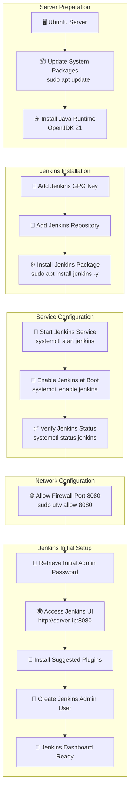

# POC for Jenkins Setup

---

| Author      | Created    | Version | Last Updated By | Last Edited On | L0 Reviewer | L1 Reviewer     | L2 Reviewer     |
| ----------- | ---------- | ------- | --------------- | -------------- | ----------- | --------------- | --------------- |
| Saransh Rai | 2026-05-26 | 1.0     | Saransh Rai     | 2026-05-26     | Anuj Jain   | Prashant Sharma | Piyush Upadhyay |

---

# Table of Contents

1. [Introduction](#1-introduction)
2. [Objective](#2-objective)
3. [Prerequisites](#3-prerequisites)
4. [Jenkins Setup POC](#4-jenkins-setup-poc)
   * [4.1 Update System Packages](#41-update-system-packages)
   * [4.2 Install Java](#42-install-java)
   * [4.3 Add Jenkins Repository Key](#43-add-jenkins-repository-key)
   * [4.4 Add Jenkins Repository](#44-add-jenkins-repository)
   * [4.5 Install Jenkins](#45-install-jenkins)
   * [4.6 Start and Enable Jenkins](#46-start-and-enable-jenkins)
   * [4.7 Check Jenkins Status](#47-check-jenkins-status)
   * [4.8 Allow Jenkins Port](#48-allow-jenkins-port)
   * [4.9 Get Initial Admin Password](#49-get-initial-admin-password)
   * [4.10 Access Jenkins in Browser](#410-access-jenkins-in-browser)
   * [4.11 Complete Jenkins Setup](#411-complete-jenkins-setup)
5. [Jenkins Workflow Diagram](#5-jenkins-workflow-diagram)
6. [Validation](#6-validation)
7. [Best Practices](#7-best-practices)
8. [Conclusion](#8-conclusion)
9. [Contact Information](#9-contact-information)
10. [Jenkins Steup Documentation](#10-jenkins-steup-documentation)
11. [References](#11-references)

---

# 1. Introduction

This document provides a Proof of Concept (POC) for setting up Jenkins on an Ubuntu server using the normal installation method. The setup includes Java installation, Jenkins repository configuration, package installation, service validation, and accessing the Jenkins web interface.

---

# 2. Objective

The objective of this POC is to install and configure Jenkins successfully on Ubuntu and validate that Jenkins is running properly on port `8080`.

---

# 3. Prerequisites

| Requirement           | Description                       |
| --------------------- | --------------------------------- |
| Operating System      | Ubuntu Server                     |
| User Access           | Sudo or root access               |
| Internet Connectivity | Required for downloading packages |
| Open Port             | Port `8080` should be accessible  |
| Java                  | Required dependency for Jenkins   |

---

# 4. Jenkins Setup POC

## <a name="41-update-system-packages"></a>    4.1 Update System Packages

```bash
sudo apt update
```

<details>
<summary>Click to View Update System Packages</summary>


</details>


This command updates the package index and ensures the latest package information is available.

---

## <a name="42-install-java"></a>    4.2 Install Java

```bash
sudo apt install fontconfig openjdk-21-jre -y
```

<details>
<summary>Click to View Install Java</summary>


</details>


Verify Java installation:

```bash
java -version
```

<details>
<summary>Click to View Verify Java installation</summary>


</details>

Expected output:

```text
openjdk version "21"
```

---

## <a name="43-add-jenkins-repository-key"></a>    4.3 Add Jenkins Repository Key

```bash
sudo wget -O /etc/apt/keyrings/jenkins-keyring.asc \
https://pkg.jenkins.io/debian-stable/jenkins.io-2026.key
```

<details>
<summary>Click to View Added Jenkins Repository Key</summary>


</details>


This command downloads and stores the Jenkins GPG repository key securely.

---

## <a name="44-add-jenkins-repository"></a>    4.4 Add Jenkins Repository

```bash
echo "deb [signed-by=/etc/apt/keyrings/jenkins-keyring.asc] https://pkg.jenkins.io/debian-stable binary/" | sudo tee /etc/apt/sources.list.d/jenkins.list > /dev/null
```

This adds the Jenkins repository to the Ubuntu package source list.

<details>
<summary>Click to View Added Jenkins Repository</summary>


</details>


---

## <a name="45-install-jenkins"></a>    4.5 Install Jenkins

```bash
sudo apt update
sudo apt install jenkins -y
```

This installs the Jenkins package and its dependencies.

<details>
<summary>Click to View Install Jenkins</summary>


</details>

---

## <a name="46-start-and-enable-jenkins"></a>    4.6 Start and Enable Jenkins

```bash
sudo systemctl start jenkins
sudo systemctl enable jenkins
```

This starts the Jenkins service and ensures it starts automatically after reboot.

<details>
<summary>Click to View Verify The Start and Enable Jenkins</summary>


</details>

---

## <a name="47-check-jenkins-status"></a>    4.7 Check Jenkins Status

```bash
sudo systemctl status jenkins
```

Expected result:

```text
active (running)
```

This validates that Jenkins is running successfully.

<details>
<summary>Click to View Verify Jenkins Status</summary>


</details>

---

## <a name="48-allow-jenkins-port"></a>    4.8 Allow Jenkins Port

```bash
sudo ufw allow 8080
sudo ufw status
```

This allows incoming traffic on Jenkins default port `8080`.

<details>
<summary>Click to View Verify - Allow Jenkins Port</summary>


</details>

---

## <a name="49-get-initial-admin-password"></a>    4.9 Get Initial Admin Password

```bash
sudo cat /var/lib/jenkins/secrets/initialAdminPassword
```

This retrieves the Jenkins initial admin password required for first-time login.

<details>
<summary>Click to View Verify Java installation</summary>


</details>

---

## <a name="410-access-jenkins-in-browser"></a>    4.10 Access Jenkins in Browser

Open Jenkins using:

```text
http://<server-public-ip>:8080
```

The Jenkins unlock page should appear.

<details>
<summary>Click to View Verify Java installation</summary>


</details>

---

## <a name="411-complete-jenkins-setup"></a>    4.11 Complete Jenkins Setup

1. Paste the initial admin password.
2. Select **Install Suggested Plugins**.
3. Create the first admin user.
4. Save and continue.
5. Open Jenkins dashboard.

---

# 5. Jenkins Workflow Diagram

The following workflow explains the complete Jenkins setup process starting from server preparation to accessing the Jenkins dashboard in the browser.



## Workflow Explanation

| Step | Description |
|------|-------------|
| Ubuntu Server | Jenkins setup starts on an Ubuntu server with sudo access. |
| Update System Packages | `sudo apt update` refreshes package metadata from Ubuntu repositories. |
| Install Java Runtime | Jenkins requires Java to run because Jenkins is Java-based software. |
| Add Jenkins GPG Key | The Jenkins repository signing key is added for package verification and security. |
| Add Jenkins Repository | Official Jenkins repository is added to Ubuntu package sources. |
| Install Jenkins Package | Jenkins package and dependencies are installed using APT package manager. |
| Start Jenkins Service | Jenkins service is started using `systemctl start jenkins`. |
| Enable Jenkins Service | Ensures Jenkins automatically starts after server reboot. |
| Verify Jenkins Status | Validates Jenkins is running successfully using systemctl status. |
| Allow Port 8080 | Firewall rule is added so Jenkins UI can be accessed externally. |
| Retrieve Initial Admin Password | Jenkins generates a one-time admin password during first startup. |
| Access Jenkins in Browser | User opens Jenkins web interface using server public IP and port `8080`. |
| Install Suggested Plugins | Jenkins installs default recommended plugins for CI/CD operations. |
| Create Admin User | First administrator account is created for Jenkins access management. |
| Jenkins Dashboard Ready | Jenkins setup is completed successfully and dashboard becomes accessible. |

---

# 6. Validation

| Validation Point  | Command / Check                 | Expected Output                  |
| ----------------- | ------------------------------- | -------------------------------- |
| Java Installation | `java -version`                 | Java version displayed           |
| Jenkins Service   | `sudo systemctl status jenkins` | `active (running)`               |
| Jenkins Port      | `sudo ss -tulnp \| grep 8080`   | Jenkins listening on port `8080` |
| Jenkins UI        | `http://<server-ip>:8080`       | Jenkins setup page accessible    |

---

# 7. Best Practices

| Best Practice                 | Description                            |
| ----------------------------- | -------------------------------------- |
| Use LTS Version               | Prefer Jenkins LTS for stability       |
| Secure Firewall               | Allow only required ports              |
| Backup Jenkins Home           | Protect Jenkins configuration and jobs |
| Use Strong Passwords          | Secure Jenkins admin account           |
| Install Required Plugins Only | Reduce unnecessary dependencies        |

---

# 8. Conclusion

This POC demonstrates a successful normal installation of Jenkins on Ubuntu using the official Jenkins repository. Java was installed as a prerequisite, Jenkins service was configured and validated, and the Jenkins web interface was accessed successfully for initial setup.

---

# 9. Contact Information

| Name        | Contact Type | Details                                                                         |
| ----------- | ------------ | ------------------------------------------------------------------------------- |
| Saransh Rai | Email        | [saransh.rai.snaatak@mygurukulam.co](mailto:saransh.rai.snaatak@mygurukulam.co) |

---

# 10. Jenkins Steup Documentation

| Title                                                                                     | Description                                                                                                                                                                                  |
| ----------------------------------------------------------------------------------------- | -------------------------------------------------------------------------------------------------------------------------------------------------------------------------------------------- |
| [Jenkins Setup Documentation](https://github.com/Snaatak-Infra-Titans/Documentations) | This documentation contains the complete Jenkins setup POC including installation steps, validation, architecture understanding, service configuration, and Infrastructure as Code concepts. |

---

# 11. References

| Title                                                                                 | Description                                      |
| ------------------------------------------------------------------------------------- | ------------------------------------------------ |
| [Jenkins Official Documentation](https://www.jenkins.io/doc/)                         | Official Jenkins documentation and setup guides  |
| [Jenkins Linux Installation Guide](https://www.jenkins.io/doc/book/installing/linux/) | Step-by-step Jenkins installation on Linux       |
| [OpenJDK Documentation](https://openjdk.org/)                                         | Java runtime documentation                       |
| [Ubuntu Package Management](https://help.ubuntu.com/community/AptGet/Howto)           | Ubuntu package installation and management guide |
