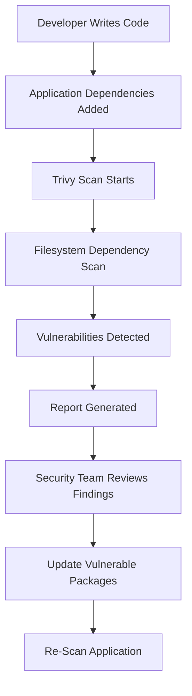

# Python Dependency Scanning – TRIVY Documentation

---

# Author Information

| Author      | Created on | Version | Last updated by | Last edited on | L0 Reviewer | L1 Reviewer     | L2 Reviewer     |
| ----------- | ---------- | ------- | --------------- | -------------- | ----------- | --------------- | --------------- |
| Saransh Rai | 21-05-2026 | v1.0    | Saransh Rai     | 21-05-2026     | Anuj Jain   | Prashant Sharma | Piyush Upadhyay |

---

# Table of Contents

1. [Introduction](#1-introduction)
2. [What is Trivy](#2-what-is-trivy)
3. [Why Trivy is Required](#3-why-trivy-is-required)
4. [Workflow Diagram](#4-workflow-diagram)
5. [Workflow Explanation](#5-workflow-explanation)
6. [Different Tools for Dependency Scanning](#6-different-tools-for-dependency-scanning)
7. [Tool Comparison](#7-tool-comparison)
8. [Advantages and Disadvantages](#8-advantages-and-disadvantages)
9. [Best Practices](#9-best-practices)
10. [Recommendations](#10-recommendations)
11. [Conclusion](#11-conclusion)
12. [Contact Information](#12-contact-information)
13. [References](#13-references)

---

# 1. Introduction

Modern applications use multiple third-party packages and libraries, which may contain security vulnerabilities. Dependency vulnerability scanning helps identify these risks before they can be exploited. 

---

# 2. What is Trivy

Trivy is an open-source vulnerability scanner developed by Aqua Security and is widely used in DevSecOps pipelines to scan operating systems, application dependencies, Docker images, Kubernetes clusters, and Infrastructure as Code (IaC). 

---

# 3. Why Trivy is Required

Trivy helps organizations detect vulnerable dependencies, reduce security risks, and automate security checks in CI/CD pipelines. Without dependency scanning, outdated libraries may expose applications to risks such as known CVEs, supply chain attacks, remote code execution (RCE), and data breaches.

---

# 4. Workflow Diagram

Click to View Workflow Diagram

---

# 5. Workflow Explanation

| Step                    | Description                                                         |
| ----------------------- | ------------------------------------------------------------------- |
| Developer Writes Code   | Application source code and dependencies are added                  |
| Dependencies Added      | Python packages are installed using requirements.txt or poetry.lock |
| Trivy Scan Starts       | Trivy filesystem scan is executed                                   |
| Vulnerability Detection | Trivy checks dependencies against vulnerability databases           |
| Report Generation       | Scan results are exported into report files                         |
| Security Review         | Teams analyze detected vulnerabilities                              |
| Remediation             | Vulnerable libraries are updated or replaced                        |
| Re-Scanning             | Security validation is performed again                              |

---

# 6. Different Tools for Dependency Scanning

| Tool                   | Description                                        |
| ---------------------- | -------------------------------------------------- |
| Trivy                  | Lightweight open-source vulnerability scanner      |
| Snyk                   | Cloud-based dependency and container scanner       |
| OWASP Dependency-Check | Open-source dependency vulnerability analysis tool |
| Grype                  | Container and filesystem vulnerability scanner     |
| Clair                  | Container vulnerability scanning platform          |
| Anchore                | Container image scanning and compliance tool       |

---

# 7. Tool Comparison

| Feature             | Trivy | Snyk     | OWASP Dependency-Check | Grype   |
| ------------------- | ----- | -------- | ---------------------- | ------- |
| Open Source         | Yes   | Partial  | Yes                    | Yes     |
| Dependency Scanning | Yes   | Yes      | Yes                    | Yes     |
| Container Scanning  | Yes   | Yes      | Limited                | Yes     |
| Kubernetes Support  | Yes   | Yes      | No                     | Limited |
| CI/CD Integration   | Easy  | Easy     | Moderate               | Easy    |
| Performance         | Fast  | Moderate | Moderate               | Fast    |
| Setup Complexity    | Easy  | Easy     | Moderate               | Easy    |

---

# 8. Advantages and Disadvantages

| Advantages                                               | Disadvantages                                          |
| -------------------------------------------------------- | ------------------------------------------------------ |
| Fast scanning and quick results                          | False positives may occur                              |
| Easy CI/CD integration                                   | Large projects may generate many findings              |
| Lightweight and simple setup                             | Requires regular vulnerability database updates        |
| Supports filesystem, containers, and Kubernetes scanning | Limited runtime security analysis                      |
| Open-source and free to use                              | Some findings may require manual validation            |
| Helps reduce application attack surface                  | Dependency remediation may require application changes |

---

# 9. Best Practices

| Best Practice               | Description                                   |
| --------------------------- | --------------------------------------------- |
| Perform Regular Scans       | Run dependency scans frequently               |
| Integrate with CI/CD        | Automate scans in Jenkins or GitLab pipelines |
| Update Dependencies         | Keep libraries updated                        |
| Review CVEs Carefully       | Analyze actual business impact                |
| Avoid Unused Libraries      | Reduce unnecessary dependencies               |
| Maintain Security Baselines | Track recurring vulnerabilities               |

---

# 10. Recommendations

Based on the scanning results, Trivy is recommended as the preferred dependency vulnerability scanning tool because it is lightweight, fast, easy to integrate with CI/CD pipelines, and supports filesystem, container, and Kubernetes security scanning. Its simple setup and efficient vulnerability detection make it suitable for modern DevSecOps workflows.

---

# 11. Conclusion

Trivy is a lightweight and efficient vulnerability scanning tool that helps identify insecure dependencies, improve application security, and support secure software delivery in DevSecOps workflows.

---

# 12. Contact Information

| Name        | Email                                                                           |
| ----------- | ------------------------------------------------------------------------------- |
| Saransh Rai | [saransh.rai.snaatak@mygurukulam.co](mailto:saransh.rai.snaatak@mygurukulam.co) |

---

# 13. References

| Reference                                                                        | Description                   |
| -------------------------------------------------------------------------------- | ----------------------------- |
| [https://trivy.dev/latest/docs/](https://trivy.dev/latest/docs/)                 | Official Trivy Documentation  |
| [https://owasp.org/www-project-top-ten/](https://owasp.org/www-project-top-ten/) | OWASP Top 10 Security Risks   |
| [https://aquasecurity.github.io/trivy/](https://aquasecurity.github.io/trivy/)   | Trivy GitHub Documentation    |
| [https://docs.python.org/3/](https://docs.python.org/3/)                         | Python Official Documentation |
